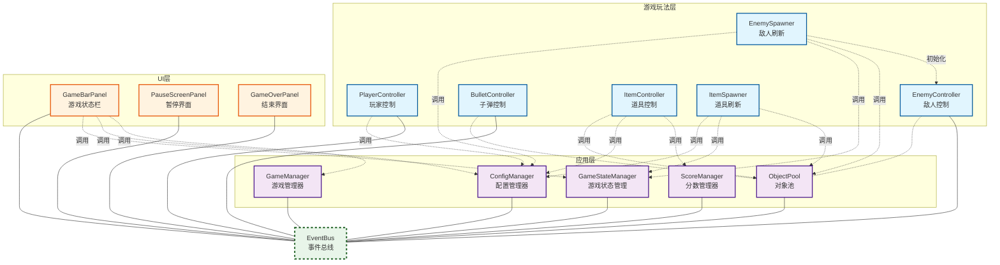

飞机大战单机版

一、项目说明

本项目是Unity实习培训的首个考核项目，基于Unity 2D引擎开发，实现了完整的单机版飞机大战玩法。项目严格遵循团队编码规范、Git提交规范和工程结构要求，核心目标是验证对Unity基础生态、组件化设计和性能优化的掌握程度。
• 开发引擎：Unity 2022 LTS（2D Core模板）

• 适配分辨率：1080×1920（竖屏）

• 仓库地址：https://github.com/phoenixowl/Unity_AirWar

二、启动方式

编辑器运行

1. 使用Unity Hub打开本项目，确保Unity版本为2022 LTS及以上
2. 打开Assets/Scenes/StartMenuScene.unity作为启动场景
3. 点击编辑器顶部按钮运行，默认进入开始界面
4. 点击开始游戏即可进入游戏场景

打包运行

1. 打开File → Build Settings
2. 确认已添加场景
3. 选择平台为PC，点击Build生成可执行文件
4. 运行打包后的程序即可

三、已完成功能

核心玩法

• 完整流程：开始界面→游戏→暂停→结算→重开/返回标题

• 玩家控制：键盘/鼠标移动、手动或自动射击、屏幕边界限制、血量系统

• 敌机系统：可能生成普通或精英敌人，对玩家进行攻击

• 子弹系统：玩家子弹、敌人子弹

• 道具系统：三种随机刷新的道具，拾取后对玩家进行增益

• 游戏特效：受击闪烁效果，爆炸效果，道具拖尾

• 分数系统：杀敌或拾取道具获得分数，随游戏难度动态变化

• 难度曲线：随游戏时间递增敌机生成速度，根据玩家受击/杀敌行为及时间动态调整难度

• 排行榜：本地记录分数排名

技术实现

• 使用对象池管理敌人，子弹，道具，粒子特效，设计通用化，可复用于后续项目

• 使用ScriptableObject管理属性配置，分数配置等数据

• 使用事件总线进行游戏逻辑和UI层的交互

四、未完成功能

• 加分项中的Boss、音乐音效、关卡系统

• 使用实际图片替代简易画面

五、主要代码结构说明

项目采用分层架构设计，分为UI层、应用层、和玩法层，确保模块间低耦合、高内聚。

• 玩法层：敌人、道具的刷新和初始化由对应spawner操控。子弹发射采用独立BulletShooter模块，对玩家和敌人通用。

• 应用层：GameManager作为全局状态机，管理游戏流程。ObjectPool实现通用对象池。ConfigManager统一封装 ScriptableObject 配置读取。ScoreManager负责分数记录。GameManager负责游戏暂停和结束。

• UI层：Panel统一接管所属UI控件，信号接收、调用和回调函数均由顶层Panel进行。

六、遇到的问题和解决方案

1.UI层控件各自监听信号，导致追踪和维护困难

解决方案：使用顶层Panel接管具体控件

2.敌人死亡时的爆炸粒子效果作为子物体，会随着敌人一起被回收，导致无法正确显示

解决方案：把爆炸粒子独立保存为Prefab,并使用对象池控制

3.受击时的闪光shader在所有敌人和玩家上同步作用

解决方案：使用MaterialPropertyBlock独立修改材质属性

七、自测结果

|                |是否达成|
|-------------------|---|
|可以从开始界面进入游戏|是|
|玩家可以正常移动和射击|是|
|敌人可以生成、移动、死亡|是|
|子弹、敌人使用对象池|是|
|有分数、血量、暂停、结算界面|是|
|游戏可以完整开始、进行、结束、重新开始|是|
|工程结构清晰|是|
|不存在明显报错|是|
|代码没有全部堆在一个脚本中|是|
|提供 README 文档|是|
